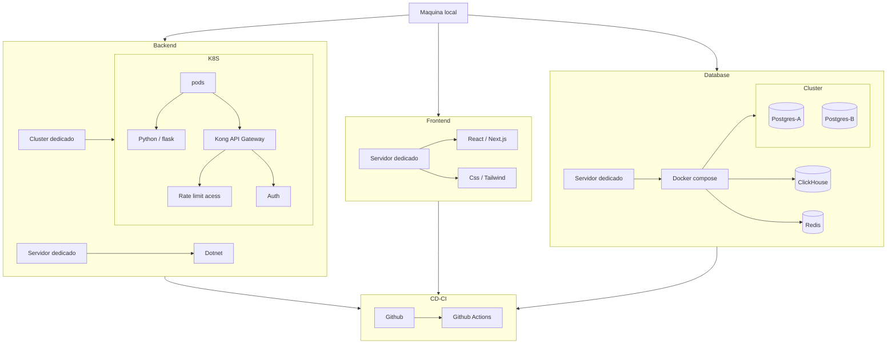

# Portugues - BR

# Introdução

O produto foi idealizado mediante um conflito pessoal de seu programador, onde existia a necessitava registrar seu fluxo de gastos diários para entender seu custo de vida e caixa.

O software foi desenvolvido para substituir uma planilha utilizada anteriormente pelo programador localizada no Google drive, que continha abas de gráficos dinâmicos e celulas para inserir valores. A Problematica da planilha são as funções que por muitas vezes podiam gerar erros por estarem fortemente ligadas aos gráficos e a necessidade constante de trocar de planilha a cada ano.

Podemos concluir que a planilha carecia de consistencia de dados e flexibilidade na manutenção.

## O porque das tecnologias?

Antes de verificamos as escolhas de Stack (estrutura e tecnologias de um produto), nos é exigido o entendimento do software para fins acadêmicos e sem investimento prévio, limitando as escolhas de tecnologias do seu desenvolvedor.

As tecnologias escolhidas de programação

* C#
* Python
    flask
* JavaScript
    Node
    React

### Infraestrutura

As aplicação utiliza cluster de banco de dados e kubernetes, ambos executados em containers Docker em rede interna

As imagens do container serão as da comunidade, como no caso do Redish ou Clickhouse, algumas exceções poderam utilizar imagens padrões como ubuntu, em ambos os casos os S.O constará

* Ubuntu Server
* Debian Bookworm
* CentOS

### Front-end

Desenvolvido em React com Next, provisionado em maquina virtual Debian Bookworm.

### Back-end

Estrutura composta por

* Monólito em C# (core)
* Dois microserviços
    Python, como serviço de dados
    C#, como serviço de login

Os serviços não devem ter comunicação aberta totalmente, é possível comunicação interna entre os serviços com endpoints privados, esse isolamento é parte da arquitetura de microserviços, o unico meio externo de comunicação entre eles deverá ser as chamadas do front-end para KongAPI com uso dos endpoints publicos.

Por possuir dois microserviços e monolito, a arquitetura é híbrida

Para evitar ataques o serviço conta com um rateLimit do kong.

### Banco de dados

* ClickHouse, banco analítico
* Redis, banco em cache
* Postgres, banco relacional com replica

### Consideraçoes

* Com essa arquitetura é possivel ter problemas pontuais em serviços distintos, priorizando o serviço Core.
* O serviço Core é um POO.
* O KongAPI poderá ser integrado com Grafana/Prometheus
* O serviço é local, por isso não é provisionado uma rede adequada.
* O Python foi escolhido para lidar com operações matemáticas e analíticas, devido ao seu desempenho excepcional e sólido. Sua principal desvantagem é o alto custo computacional e a dificuldade em lidar com muitas requisições simultâneas.
* O C# para ser o Core da aplicação por sua consistencia e resiliencia, sua principal desvantagem é a curva de aprendizado e verbosidade.
* O JavaScript para Front-end é padrão de mercado e baixa curva de aprendizado, suas desvantagem é o tempo médio de resposta inferior a tecnologias concorrentes como PHP, No front-end pode sobrecarregar client-side se for mal otimizado.
* O Postgres por sua estrutura e comportamentos com relação a segmentação das bases e possuir uma arquitetura que reforça o uso de schemas, é ótimo para altas requisições porem não lida muito bem com grandes volumes de dados e procedures internas.
* Redis é padrão de mercado é possui alta compatibilidade com Kong, possui tempo de resposta extremamente agíl, sua desvantagem é a falta de atualização pois nas versões mais novas é pago
* ClickHouse é um banco colunar com um dos maiores desempenhos atuais, é pessímo para transações de alterações de dados porem lida extremamente bem com alto carga de dados em suas tabelas.

### Tabela matrix de comparação programação

| Categoria     | Python| C#    | JavaScript |
|---------------|-------|-------|-------|
| Facilidade    | 10    | 6     | 8     |
| Velocidade    | 10    | 4     | 6     |
| Desempenho    | 7     | 9     | 6     |
| Comunidade    | 10    | 7     | 10    |
| Documentação  | 10    | 10    | 8     |

### Tabela matrix de comparação SGBD

| Categoria     | Redis | Postgres  | ClickHouse    |
|---------------|-------|-------|-------|
| Facilidade    | 6     | 8     | 6     |
| Velocidade    | 10    | 6     | 9     |
| Desempenho    | 10    | 6     | 9     |
| Escalabilidade| 5     | 8     | 8     |
| Comunidade    | 6     | 10    | 4     |
| Custo         | 0     | 0     | 0     |

# English - EUA
