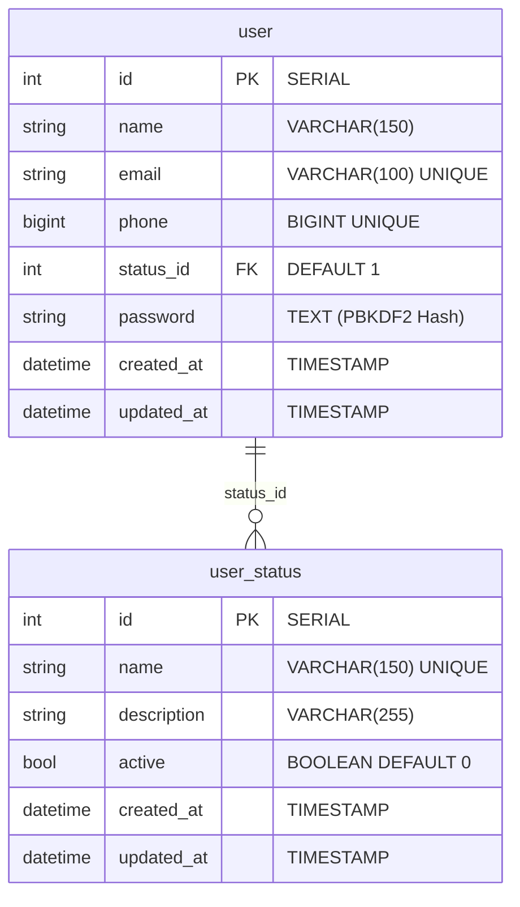
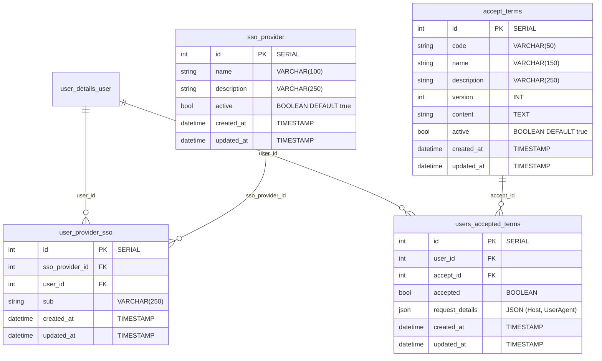
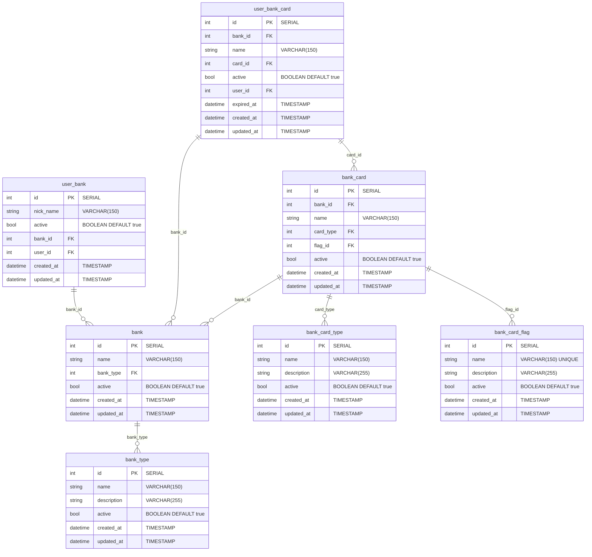

# Banco de Dados e Esquemas (Persistência Poliglota)

O **Nievo EasyFin** utiliza a estratégia de **Persistência Poliglota (Polyglot Persistence)**. O banco relacional principal (PostgreSQL 16) possui seus esquemas e tabelas estritamente versionados via **Alembic** e consumidos via **EF Core / Dapper** no C#.

---

## 🗄️ 1. PostgreSQL (Relacional - OLTP)

A estrutura do PostgreSQL é organizada em 5 schemas principais divididos entre os serviços:
- **Serviço Auth (`NievoEasyFin.Auth`):** Schemas `user_details` e `journey`.
- **Serviço Core (`NievoEasyFin.Core`):** Schemas `accounts`, `goals` e `payment`.

---

### 👤 Schema `user_details` (Cadastro e Status do Usuário)

Armazena as informações cadastrais fundamentais dos usuários do sistema.



---

### 🗺️ Schema `journey` (Jornada, SSO e Aceite de Termos)

Armazena os registros de integração social (SSO) e o histórico de auditoria de aceite dos Termos de Uso.



---

### 💳 Schema `accounts` (Contas Bancárias, Tipos e Cartões)

Armazena as instituições financeiras, os tipos de conta, o catálogo de cartões de banco e as preferências atreladas aos usuários.



---

### 🎯 Schemas `goals` e `payment`

- **Schema `goals`:** Reservado para o planejamento financeiro, metas de economia e tetos orçamentários por categoria.
- **Schema `payment`:** Reservado para o registro detalhado de transações, parcelamentos e fluxo de caixa.

---

## 🔍 2. Ligações e Queries dos Models C# (Dapper & EF Core)

Abaixo estão detalhadas as principais consultas executadas pelos Models da aplicação em `NievoEasyFin.Application/Models`:

### A. Consulta de Usuário SSO (`UserModel.cs`)
Realiza um JOIN cruzado entre os esquemas `user_details` e `journey`:

```sql
SELECT 
    u.id, u.name, u.email, u.phone, u.status_id, u.created_at, u.updated_at, u.password
FROM
    user_details."user" u
INNER JOIN journey.user_provider_sso ups 
    ON u.id = ups.user_id 
WHERE 1=1
    AND ups.sso_provider_id = @providerId
    AND ups.sub = @subId
    AND u.status_id = 2; -- EnumUserStatus.ACTIVE
```

### B. Consulta de Contas Bancárias do Usuário (`UserBankModel.cs`)
Realiza JOINs internos dentro do esquema `accounts`:

```sql
SELECT
    b.name AS Name,
    b.bank_type AS BankType,
    ub.nick_name AS NickName,
    bt.name AS BankTypeName
FROM accounts.user_bank ub
    INNER JOIN accounts.bank b ON ub.bank_id = b.id
    INNER JOIN accounts.bank_type bt ON b.bank_type = bt.id
WHERE
    ub.user_id = @userId
    AND ub.active = true
    AND b.active = true
    AND bt.active = true;
```

### C. Consulta de Cartões de Usuário (`UserBankCardModel.cs`)
Combina 5 tabelas do esquema `accounts` com paginação por *Window Function* (`count(*) over()`):

```sql
SELECT 
    ubc.id AS UserBankCardId,
    ubc.name AS UserBankCardName,
    ubc.active AS Active,
    ubc.expired_at AS ExpiredAt,
    b.name AS BankName,
    bc.name AS BankCardName,
    bct.name AS BankCardType,
    bcf.name AS BankCardFlag,
    COUNT(*) OVER() AS Records
FROM accounts.user_bank_card ubc
    INNER JOIN accounts.bank b ON ubc.bank_id = b.id 
    INNER JOIN accounts.bank_card bc ON ubc.card_id = bc.id AND ubc.bank_id = bc.bank_id
    INNER JOIN accounts.bank_card_type bct ON bc.card_type = bct.id 
    INNER JOIN accounts.bank_card_flag bcf ON bc.flag_id = bcf.id 
WHERE ubc.user_id = @userId
    AND ubc.active = @active
    AND b.active = true
    AND bc.active = true
    AND bct.active = true
    AND bcf.active = true
LIMIT @limit OFFSET @offset;
```

---

## ⚡ 3. Redis (Cache e Dados Voláteis)

- **Entidades Bancárias (`BankCacheEntity`):** Cache com a chave `bank:{name}:{type}` para evitar reconsultas no PostgreSQL.
- **Tipos de Banco (`BankTypeCacheEntity`):** Cache com a chave `bank_type:{id}`.
- **PINs de Ativação (`TokenSingupUserEntity`):** Chave `singup_token:{email}` (TTL de 15 min).
- **PINs de Redefinição (`TokenPasswordResetEntity`):** Chave `reset_password:{email}` (TTL curto).

---

## 📊 4. ClickHouse (OLAP)

Cluster colunar de 2 nós (`clickhouse_nodea` e `clickhouse_nodeb`) sincronizados via **Zookeeper** (`zookeeper:2181`) para agregação de relatórios analíticos de alta performance.
