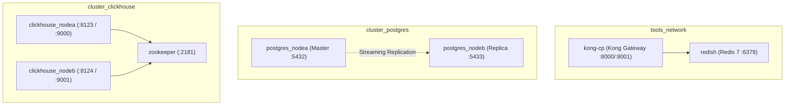

# Gateway e Infraestrutura

A infraestrutura do **Nievo EasyFin** foi projetada para garantir segurança, resiliência e facilidade de orquestração via **Docker Compose** e **Kubernetes (K8s)**.

---

## 🚪 1. API Gateway (Kong)

Todas as requisições oriundas do cliente (Frontend React/Vite) ou de clientes externos entram exclusivamente através do **Kong API Gateway** (Porta `8000`).

### 🛠️ Configuração Declarativa (`kong.yml`)

O Kong é executado em modo DB-less (sem necessidade de banco próprio), utilizando o arquivo de configuração declarativa `infraestrutura/docker/tools/kong/kong.yml`.

#### Servicios e Rotas Mapeadas:

| Nome do Serviço | Upstream Interno | Caminho de Entrada | Strip Path | Descrição |
| :--- | :--- | :--- | :--- | :--- |
| **`auth-service`** | `http://127.0.0.1:8081` | `/api/auth` | `true` | Roteia chamadas para o microsserviço `NievoEasyFin.Auth`. |
| **`core-service`** | `http://127.0.0.1:8082` | `/api/core` | `true` | Roteia chamadas para o Monólito `NievoEasyFin.Core`. |
| **`data-service`** | `http://127.0.0.1:8083` | `/api/data` | `true` | Roteia chamadas para o microsserviço de Analytics Python. |

---

### 🛡️ Plugins Ativos no Gateway

1. **Rate Limiting Plugin:**
   - **Mecanismo:** Protege a aplicação contra ataques de força bruta e negação de serviço (DoS).
   - **Política de Armazenamento:** Redis (`redish:6379`, `redis_database: 1`).
   - **Limites Configurados:**
     - 5 requisições por segundo (`second: 5`).
     - 280 requisições por minuto (`minute: 280`).
     - 1.500 requisições por hora (`hour: 1500`).
   - **Resposta em caso de excede:** HTTP `429 Too Many Requests` com a mensagem `"API rate limit exceeded in Kong"`.

2. **CORS (Cross-Origin Resource Sharing) Plugin:**
   - **Protocolos:** HTTP e HTTPS.
   - **Métodos Permitidos:** GET, POST, PUT, DELETE.
   - **Headers Permitidos:** `Authorization`, `Content-Type`.
   - **Max Age:** 7.200 segundos (2 horas de pré-flight cache).

3. **JWT Authentication Plugin:**
   - **Validação de Token:** O Kong intercepta as requisições aos caminhos protegidos e valida a assinatura JWT (`HS256`) e a chave de identificação (`kid`).

---

## 🐳 2. Orquestração com Docker Compose

O ambiente de infraestrutura local é provisionado pelo arquivo `infraestrutura/docker/docker-compose.yml`.

### Topologia dos Containers:

---

## ☸️ 3. Orquestração em Kubernetes (K8s)

Em ambientes de teste e produção, a aplicação pode ser implantada em um cluster Kubernetes com os seguintes recursos:

- **Pods Dedicados:** Escala independente para os pods de Auth, Core e Data Analytics.
- **ConfigMaps & Secrets:** Injeção segura de credenciais SMTP, chaves de assinatura JWT e strings de conexão de banco.
- **Horizontal Pod Autoscaler (HPA):** Dimensionamento automático do microsserviço de Auth e Core com base em consumo de CPU e uso de memória.
