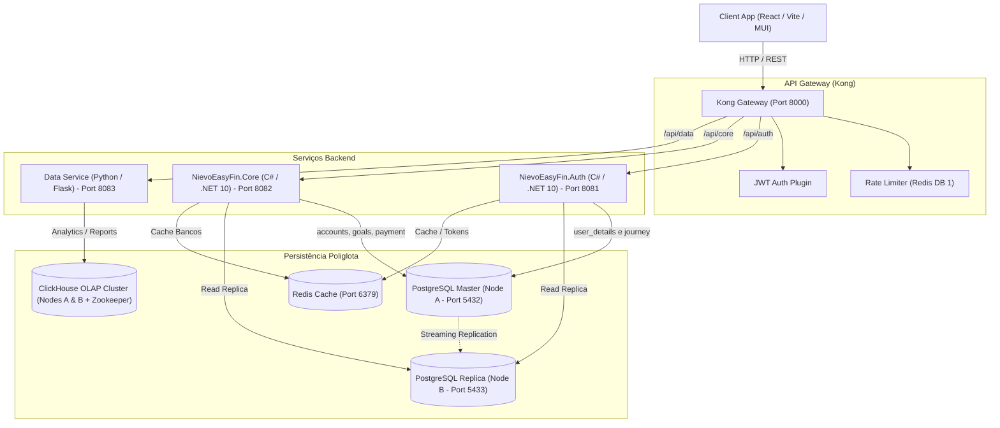

# Arquitetura do Sistema

O **Nievo EasyFin** adota uma **arquitetura híbrida**, combinando um monólito robusto com microsserviços especializados para equilibrar a consistência do negócio com alta escalabilidade e isolamento de responsabilidades.

---

## 🏗️ Visão Geral da Arquitetura

---

## 🧩 Componentes Principais

### 1. Microsserviço de Autenticação e Segurança (`NievoEasyFin.Auth`)
- **Tecnologia:** C# / .NET 10.
- **Responsabilidades:** 
  - Gestão de usuários e status no schema `user_details` (`user_details.user` e `user_details.user_status`).
  - Gestão de login social SSO Google no schema `journey` (`journey.sso_provider` e `journey.user_provider_sso`).
  - Emissão e validação de tokens JWT (HS256 com claims customizadas).
  - Autenticação e verificação de senhas com hashing seguro PBKDF2.
  - Recuperação de senha por e-mail via PIN temporário (armazenado em cache Redis).
  - Gestão de termos de uso e auditoria de aceites (`journey.accept_terms` e `journey.users_accepted_terms`).

### 2. Monólito Core (`NievoEasyFin.Core`)
- **Tecnologia:** C# / .NET 10 (Arquitetura orientada a objetos com injeção de dependência).
- **Responsabilidades:**
  - Regras do domínio financeiro no schema `accounts` (`accounts.bank`, `accounts.bank_type`, `accounts.user_bank`, `accounts.bank_card`, `accounts.bank_card_type`, `accounts.bank_card_flag`, `accounts.user_bank_card`).
  - Planejamento e orçamentos no schema `goals`.
  - Lançamentos e transações de pagamento no schema `payment`.

### 3. Microsserviço de Análise e Inteligência (`Data Service`)
- **Tecnologia:** Python / Flask.
- **Responsabilidades:**
  - Processamento analítico de alto desempenho sobre o histórico financeiro.
  - Geração de relatórios consolidados e previsões consumindo dados do **ClickHouse**.

---

## 💾 Estratégia de Persistência Poliglota (Polyglot Persistence)

1. **PostgreSQL 16 (Relacional Transacional):**
   - Configurado em cluster Master-Replica (`postgres_nodea` e `postgres_nodeb`).
   - Dividido nos schemas `user_details`, `journey`, `accounts`, `goals` e `payment`.

2. **Redis 7 (Armazenamento em Memória):**
   - Cache de entidades bancárias (`BankCacheEntity`) e tipos de banco (`BankTypeCacheEntity`).
   - Armazenamento temporário de PINs de cadastro e redefinição de senha com TTL (Time-To-Live).
   - Backend dos contadores de Rate Limiting do Kong Gateway (database 1).

3. **ClickHouse (Banco Colunar OLAP):**
   - Armazenamento analítico otimizado para grandes volumes em cluster de 2 nós com coordenação via **Apache Zookeeper**.