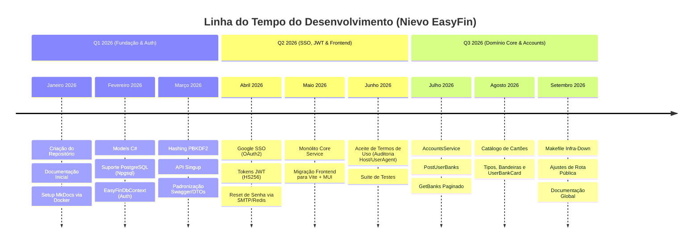

# Histórico de Alterações e Linha do Tempo (Changelog)

Este documento registra a **linha do tempo precisa** do desenvolvimento do **Nievo EasyFin**, construída a partir do histórico oficial de commits, ramificações (*branches*) e *Pull Requests* do repositório.

---

## ⏳ Linha do Tempo Visual do Projeto

---

## 📜 Histórico Detalhado por Milestones e Pull Requests

### 📅 Setembro / 2026 — Ajustes de Rota, Infraestrutura e Documentação Global
* **Revisão e Expansão da Documentação (2026-09-06):** Reorganização total do MkDocs com inclusão da arquitetura de schemas do Alembic (`user_details`, `journey`, `accounts`, `goals`, `payment`), detalhamento dos JOINs dos Models C#, contratos de API e arquitetura do Frontend React/Vite/MUI.
* **PR #41 — `Update/get-banks-path-to-public` (`b3b2c0f`, `4132338`):** Alteração da rota do endpoint de listagem de bancos para o caminho público (`/api/public/v1/Accounts/banks`).
* **PR #40 — `add/ci-compose-infra-down` (`9c0375b`, `7acd1f1`):** Inclusão de novas opções no `Makefile` para derrubar a infraestrutura (`make infra-down`) e atualização das variáveis de ambiente de exemplo.

---

### 📅 Agosto / 2026 — Domínio Financeiro: Cartões de Crédito/Débito e Bandeiras
* **PR #39 — `Feat/flag-card` (`89ce6be`, `8ad5bce`, `29162d8`):** Implementação da tabela `accounts.bank_card_flag`, suporte às bandeiras de cartão (Visa, Mastercard, Elo, Amex), migração no Alembic e testes de integração.
* **PR #38 — `Feat/user-card` (`015fd56`, `9441e68`, `4aa809a`, `76cce86`):** Criação dos endpoints de cadastro e consulta de cartões de banco vinculados ao usuário (`GET` e `POST /api/public/v1/Accounts/user:bank-card`) na tabela `accounts.user_bank_card`.
* **PR #37 — `feat/get-bank-card` (`908ec7c`, `13626f2`, `383faa1`):** Endpoints para consulta do catálogo de cartões de banco com filtros por tipo, instituição e bandeira (`GET /api/public/v1/Accounts/bank-card`).
* **PR #36 — `Feat/card-bank` (`16f0aff`, `bbbf657`, `a652bb4`):** Criação dos endpoints para listagem de tipos de cartão (`GET /card-type`) e adição da coluna `flag_id` na tabela `accounts.bank_card`.
* **PR #35 — `Feat/get-user-bank` (`152d61b`, `59b4e64`, `d9f83ba`):** Criação do endpoint `GET /api/public/v1/Accounts/user-banks` para listagem de contas do usuário logado e expansão da suíte de testes.

---

### 📅 Julho / 2026 — Domínio Core: Contas Bancárias e Instituições Financeiras
* **PR #34 — `Feat/get-banks` (`5713238`, `944c4a0`, `7274dd3`):** Implementação do endpoint de busca paginada de bancos (`GET /Accounts/banks`) com testes unitários.
* **PR #33 — `Feat/user-bank` (`3fe8572`, `455eaf2`, `6c1db7f`):** Implementação do endpoint de vínculo de conta bancária ao usuário (`POST /Accounts/user-banks`) gravando na tabela `accounts.user_bank`.
* **PR #32 — `Feat/Accounts-service` (`69ca01c`, `8843f64`):** Criação da estrutura base do serviço `AccountsService` no monólito Core.

---

### 📅 Junho / 2026 — Aceite Obrigatório de Termos de Uso e Deploy do Core
* **PR #31 — `Create test for get terms users` (`c2b7554`):** Criação da suíte de testes unitários para consulta do histórico de termos aceitos por usuário.
* **PR #30 — `Fix: deploy core service` (`e9bb499`):** Ajustes de configuração para deploy do monólito Core.
* **PR #26 / #27 / #28 / #29 — `feat-implement-get-accept-terms` (`e9c7dae`, `2d7a985`):** Endpoint `GET /accept-terms:singup` e integração da página de exibição de Termos de Uso no frontend.
* **PR #25 — `feat/auth/accept-terms` (`707e7ea`):** Obrigatoriedade de aceite dos Termos de Uso (`accept_terms: true`), criação das tabelas `journey.accept_terms` e `journey.users_accepted_terms` (com metadados JSON de Host e User-Agent para auditoria legal).

---

### 📅 Maio / 2026 — Migração Histórica do Frontend, Testes e Criação do Core
* **PR #21 / #22 / #23 — `feat/frontend-refactor` (`4d4d6ba`, `0342a35`, `992459f`):** **Migração do Frontend**: Substituição do bundler Next.js + Tailwind pelo **Vite 6** + **Material UI (MUI v6)**, adoção do padrão modular de 4 arquivos (`index.jsx`, `View.jsx`, `styles.js`, `api.js`) e rotas protegidas (`ProtectedRoute` / `PublicRoute`).
* **PR #19 / #20 — `Feat/core-service` & `Update/docs_build` (`89e70a7`, `c851830`):** Rename do namespace global da solução para `NievoEasyFin`, criação do projeto Monólito `NievoEasyFin.Core` e expansão da documentação MkDocs.
* **PR #16 / #17 / #18 — `Feat/users-service-tests` (`f90fa9a`, `1abd371`, `e44a638`):** Implementação da infraestrutura de testes unitários/integrados para `UsersService` e `AuthenticatorService`.

---

### 📅 Abril / 2026 — Autenticação JWT, SSO Google e Recuperação por E-mail
* **PR #13 — `license-add` (`479dc8d`):** Adição da Licença MIT ao repositório.
* **PR #12 — `Feat/healthCheck` (`856aea6`):** Endpoints administrativos de verificação de conectividade com Redis e servidor SMTP.
* **PR #11 — `Feat/reset-password` (`4bc78a3`, `8b409b5`, `8302605`):** Fluxo completo de redefinição de senha por PIN numérico de 6 dígitos. Integração com Redis (`redis_main`) e envio de e-mails via SMTP/MailKit (`SmtpProvider`).
* **PR #9 / #10 — `Feat/login` & `Feat/login-sso` (`786812e`, `b9c6df7`):** Implementação dos endpoints de login local e SSO, emissão e assinatura de tokens JWT (`HS256`), extensões de ClaimsIdentity e autorização Swagger.
* **PR #7 / #8 — `Feature-auth/create-user-endpoint` & `Fix/Google-sso-project-validate` (`dbfbc1a`, `8c5c87e`):** Cadastro via Google SSO (`POST /singup-sso`) e validação estrita do `client_id` (claim `aud`) no GCP.

---

### 📅 Março / 2026 — Hashing de Senhas (PBKDF2) e Estruturação das APIs
* **Cadastro e Segurança (`94801d1`, `fa94618`, `fd705e5`):** Implementação da criptografia de senhas por PBKDF2 (`CryptoPasswordService`) e primeiro endpoint de criação de conta (`POST /singup`).
* **Swagger e Template API (`8e9eb5d`, `474feb5`):** Padronização das respostas de API (`ResponseApiSucess` / `ResponseApiError`) e documentação Swagger.

---

### 📅 Fevereiro / 2026 — Contexto de Banco de Dados C# e PostgreSQL
* **PR #5 / #6 — `Create/infra-and-user-models` & `Create/csharp-context-auth-db` (`f3d4118`, `c43e932`):** Implementação da classe `EasyFinDbContext` no C# com suporte a PostgreSQL Npgsql, conectando aos schemas `user_details` e `journey`.

---

### 📅 Janeiro / 2026 — Criação do Repositório e Setup Inicial
* **PR #1 / #2 / #3 / #4 (`Basic/intro-doc`, `Update/docs-change-from-readme-to-mkdocs`):** Commit inicial (`77f985e`), documentação inicial do produto e migração da documentação para **MkDocs Material** via Docker.
