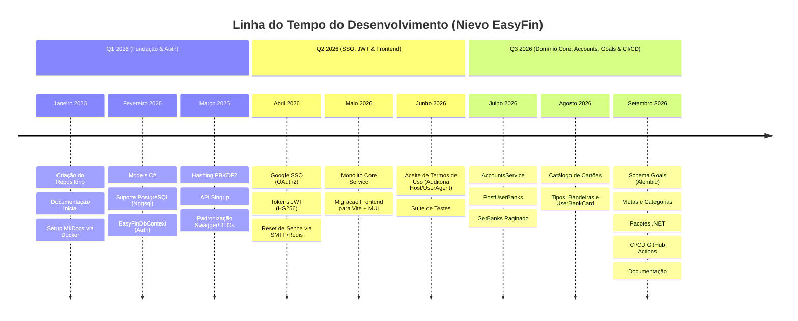

# Histórico de Alterações e Linha do Tempo (Changelog)

Este documento registra a **linha do tempo precisa** do desenvolvimento do **Nievo EasyFin**, construída a partir do histórico oficial de commits, ramificações (*branches*) e *Pull Requests* do repositório.

---

## ⏳ Linha do Tempo Visual do Projeto

```mermaid
timeline
    title Linha do Tempo do Desenvolvimento (Nievo EasyFin)
    section Q1 2026 (Fundação & Auth)
        Janeiro 2026 : Criação do Repositório : Documentação Inicial : Setup MkDocs via Docker
        Fevereiro 2026 : Models C# : Suporte PostgreSQL (Npgsql) : EasyFinDbContext (Auth)
        Março 2026 : Hashing PBKDF2 : API Singup : Padronização Swagger/DTOs
    section Q2 2026 (SSO, JWT & Frontend)
        Abril 2026 : Google SSO (OAuth2) : Tokens JWT (HS256) : Reset de Senha via SMTP/Redis
        Maio 2026 : Monólito Core Service : Migração Frontend para Vite + MUI
        Junho 2026 : Aceite de Termos de Uso (Auditoria Host/UserAgent) : Suíte de Testes
    section Q3 2026 (Domínio Core, Accounts, Goals & CI/CD)
        Julho 2026 : AccountsService : PostUserBanks : GetBanks Paginado
        Agosto 2026 : Catálogo de Cartões : Tipos, Bandeiras e UserBankCard
        Setembro 2026 : Schema Goals (Alembic) : Metas e Categorias : Pacotes .NET : CI/CD GitHub Actions : Documentação
```

---

## 📜 Histórico Detalhado por Milestones e Pull Requests

### 📅 Setembro / 2026 — Domínio de Metas & Categorias, Pipeline de CI/CD e Infraestrutura
* **PR #48 — `Feat(build): add a ci-cd test` (`7b96f62`):**
  - Implementação da pipeline automatizada de integração contínua (CI/CD) no GitHub Actions (`.github/workflows/backend-tests.yml`), acionada em todo Pull Request com setup de runner .NET 10.0.x, restore, build e execução de `dotnet test`.
  - Criação da classe auxiliar `NievoEasyFin.Tests/Mocks/Helpers/TestEnvironment.cs` para injeção idempotente de variáveis de ambiente em memória, desacoplando a suíte de testes de arquivos `.env` em disco.
  - Refatoração das classes de teste base (`AuthenticatorServiceTestBase`, `UsersServiceTestBase`, `AccountsServiceTestBase`) para garantir execução isolada.
* **PR #47 — `Feat/get goals and categories` (`78101a2`):**
  - Implementação dos endpoints de consulta paginada `GET /api/public/v1/Accounts/user:goal` e `GET /api/public/v1/Accounts/user:category` no `AccountsController`.
  - Criação de views de leitura otimizadas com Dapper:
    - `UserGoalView`: paginação via *window function* `count(*) over() as Records`, ordenação por ID e filtros por estado ativo.
    - `UserCategoryView`: `LEFT JOIN` entre `goals.category` e `goals.goals` retornando o nome e descrição da meta vinculada.
  - Adição de DTOs (`GetUserGoalRequest`, `GetUserGoalResponse`, `GetUserCategoryRequest`, `GetUserCategoryResponse`) e validadores FluentValidation (`GetUserGoalValidatorAsync`, `GetUserCategoryValidatorAsync`).
  - Criação de builders de requisição (`GetUserGoalRequestBuilder`, `GetUserCategoryRequestBuilder`) e suíte completa de testes unitários (`GetUserGoalAsyncTest.cs`, `GetUserCategoryAsyncTest.cs`).
* **PR #46 — `Feat/category` (`f8007ae`):**
  - Criação do endpoint de cadastro de categorias financeiras do usuário (`POST /api/public/v1/Accounts/user:category`).
  - Mapeamento da entidade `CategoryEntity` na tabela `goals.category` e implementação do modelo `CategoryModel`.
  - Implementação da **regra de negócio de exclusividade mútua**: uma categoria deve ser vinculada obrigatoriamente a uma meta (`goal > 0`) OU a uma categoria pai (`parent_category > 0`), sendo rejeitadas requisições com ambos ou nenhum (`POSTUSERCATEGORYASYNC_CORESERVICE_400_CATEGORY_ONLY_CAN_BE_CREATED_WITH_ONE_GOAL_OR_PARENT`).
  - Validação de existência da categoria pai, unicidade de nome ativo por usuário e testes unitários com builder (`PostUserCategoryAsyncTest.cs`).
  - Registro de `DbSet<CategoryEntity> Category` em `AuthDbContext.cs` e injeção no container DI do `NievoEasyFin.Core/Startup.cs`.
* **PR #45 — `Feat/goals` (`9166a18`):**
  - Criação do endpoint de cadastro de metas orçamentárias (`POST /api/public/v1/Accounts/user:goal`).
  - Mapeamento da entidade `GoalEntity` na tabela `goals.goals` e modelo `GoalModel`.
  - Criação de DTOs e validações: `PostUserGoalRequest`, `PostUserGoalValidatorAsync` (validação de `amount > 0`, prazo futuro `expire_at > DateTime.Today` e nome de 2 a 99 caracteres).
  - Regra de unicidade de nome para metas ativas por usuário (`POSTUSERGOALASYNC_CORESERVICE_400_GOAL_ALREADY_EXIST`).
  - Registro de `DbSet<GoalEntity> Goal` em `AuthDbContext.cs`, injeção em `Startup.cs` e suíte de testes com builder (`PostUserGoalAsyncTest.cs`).
* **PR #44 — `Update(dotnet): package` (`86a87e8`):**
  - Atualização abrangente de pacotes NuGet em todos os projetos da solução (`NievoEasyFin.Application`, `NievoEasyFin.Auth`, `NievoEasyFin.Core` e `NievoEasyFin.Tests`), alinhando dependências com o .NET 10.
* **PR #43 — `Feat(alembic): add new tables for schema goals` (`091475c`):**
  - Criação das migrações Alembic `2aaf6a5ab21b_create_goals_tables.py` e `7159b0d736ad_create_goals_constrains.py`.
  - Definição estrutural das tabelas `goals.goals` e `goals.category`.
  - Criação da constraint relacional `fk_goals_category` conectando `goals.category(goals_id)` a `goals.goals(id)`.
  - Criação de índices de busca (`idx_goals_category_parent`, `idx_goals_category_active`, `idx_goals_category_user`, `idx_goals_user`, `idx_goals_active`, `idx_goals_expire_at`).
  - Atribuição de permissões de `USAGE`, DML e sequences aos usuários de banco `cross_database_user` e `app_core_service_efn`.
* **PR #42 — `Docs: update docs and chancelog using the current state of the project and the history (git)` (`a50bae5`):**
  - Revisão e reorganização global da documentação técnica no MkDocs com inclusão de diagramas Mermaid, mapeamento de persistência poliglota, catálogo de APIs e histórico detalhado.
* **PR #41 — `Update/get-banks-path-to-public` (`b3b2c0f`, `4132338`):** Alteração da rota do endpoint de listagem de bancos para o caminho público (`/api/public/v1/Accounts/banks`).
* **PR #40 — `add/ci-compose-infra-down` (`9c0375b`, `7acd1f1`):** Inclusão de novas opções no `Makefile` para derrubar a infraestrutura (`make infra-down`) e atualização das variáveis de ambiente de exemplo.

---

### 📅 Agosto / 2026 — Domínio Financeiro: Cartões de Crédito/Débito e Bandeiras
* **PR #39 — `Feat/flag-card` (`89ce6be`, `8ad5bce`, `29162d8`):** Implementação da tabela `accounts.bank_card_flag`, suporte às bandeiras de cartão (Visa, Mastercard, Elo, Amex), migração no Alembic e testes de integração.
* **PR #38 — `Feat/user-card` (`015fd56`, `9441e68`, `4aa809a`, `76cce86`):** Criação dos endpoints de cadastro e consulta de cartões de banco vinculados ao usuário (`GET` e `POST /api/public/v1/Accounts/user:bank-card`) na tabela `accounts.user_bank_card`.
* **PR #37 — `feat/get-bank-card` (`908ec7c`, `13626f2`, `383faa1`):** Endpoints para consulta do catálogo de cartões de banco com filtros por tipo, instituição e bandeira (`GET /api/public/v1/Accounts/bank-card`).
* **PR #36 — `Feat/card-bank` (`16f0aff`, `bbbf657`, `a652bb4`):** Criação dos endpoints para listagem de tipos de cartão (`GET /card-type`) e adição da coluna `flag_id` na tabela `accounts.bank_card`.
* **PR #35 — `Feat/get-user-bank` (`152d61b`, `59b4e64`, `d9f83ba`):** Criação do endpoint `GET /api/public/v1/Accounts/user-banks` para listagem de contas do usuário logado e expansão da suíte de testes.

---

### 📅 Julho / 2026 — Domínio Core: Contas Bancárias e Instituições Financeiras
* **PR #34 — `Feat/get-banks` (`5713238`, `944c4a0`, `7274dd3`):** Implementação do endpoint de busca paginada de bancos (`GET /Accounts/banks`) com testes unitários.
* **PR #33 — `Feat/user-bank` (`3fe8572`, `455eaf2`, `6c1db7f`):** Implementação do endpoint de vínculo de conta bancária ao usuário (`POST /Accounts/user-banks`) gravando na tabela `accounts.user_bank`.
* **PR #32 — `Feat/Accounts-service` (`69ca01c`, `8843f64`):** Criação da estrutura base do serviço `AccountsService` no monólito Core.

---

### 📅 Junho / 2026 — Aceite Obrigatório de Termos de Uso e Deploy do Core
* **PR #31 — `Create test for get terms users` (`c2b7554`):** Criação da suíte de testes unitários para consulta do histórico de termos aceitos por usuário.
* **PR #30 — `Fix: deploy core service` (`e9bb499`):** Ajustes de configuração para deploy do monólito Core.
* **PR #26 / #27 / #28 / #29 — `feat-implement-get-accept-terms` (`e9c7dae`, `2d7a985`):** Endpoint `GET /accept-terms:singup` e integração da página de exibição de Termos de Uso no frontend.
* **PR #25 — `feat/auth/accept-terms` (`707e7ea`):** Obrigatoriedade de aceite dos Termos de Uso (`accept_terms: true`), criação das tabelas `journey.accept_terms` e `journey.users_accepted_terms` (com metadados JSON de Host e User-Agent para auditoria legal).

---

### 📅 Maio / 2026 — Migração Histórica do Frontend, Testes e Criação do Core
* **PR #21 / #22 / #23 — `feat/frontend-refactor` (`4d4d6ba`, `0342a35`, `992459f`):** **Migração do Frontend**: Substituição do bundler Next.js + Tailwind pelo **Vite 6** + **Material UI (MUI v6)**, adoção do padrão modular de 4 arquivos (`index.jsx`, `View.jsx`, `styles.js`, `api.js`) e rotas protegidas (`ProtectedRoute` / `PublicRoute`).
* **PR #19 / #20 — `Feat/core-service` & `Update/docs_build` (`89e70a7`, `c851830`):** Rename do namespace global da solução para `NievoEasyFin`, criação do projeto Monólito `NievoEasyFin.Core` e expansão da documentação MkDocs.
* **PR #16 / #17 / #18 — `Feat/users-service-tests` (`f90fa9a`, `1abd371`, `e44a638`):** Implementação da infraestrutura de testes unitários/integrados para `UsersService` e `AuthenticatorService`.

---

### 📅 Abril / 2026 — Autenticação JWT, SSO Google e Recuperação por E-mail
* **PR #13 — `license-add` (`479dc8d`):** Adição da Licença MIT ao repositório.
* **PR #12 — `Feat/healthCheck` (`856aea6`):** Endpoints administrativos de verificação de conectividade com Redis e servidor SMTP.
* **PR #11 — `Feat/reset-password` (`4bc78a3`, `8b409b5`, `8302605`):** Fluxo completo de redefinição de senha por PIN numérico de 6 dígitos. Integração com Redis (`redis_main`) e envio de e-mails via SMTP/MailKit (`SmtpProvider`).
* **PR #9 / #10 — `Feat/login` & `Feat/login-sso` (`786812e`, `b9c6df7`):** Implementação dos endpoints de login local e SSO, emissão e assinatura de tokens JWT (`HS256`), extensões de ClaimsIdentity e autorização Swagger.
* **PR #7 / #8 — `Feature-auth/create-user-endpoint` & `Fix/Google-sso-project-validate` (`dbfbc1a`, `8c5c87e`):** Cadastro via Google SSO (`POST /singup-sso`) e validação estrita do `client_id` (claim `aud`) no GCP.

---

### 📅 Março / 2026 — Hashing de Senhas (PBKDF2) e Estruturação das APIs
* **Cadastro e Segurança (`94801d1`, `fa94618`, `fd705e5`):** Implementação da criptografia de senhas por PBKDF2 (`CryptoPasswordService`) e primeiro endpoint de criação de conta (`POST /singup`).
* **Swagger e Template API (`8e9eb5d`, `474feb5`):** Padronização das respostas de API (`ResponseApiSucess` / `ResponseApiError`) e documentação Swagger.

---

### 📅 Fevereiro / 2026 — Contexto de Banco de Dados C# e PostgreSQL
* **PR #5 / #6 — `Create/infra-and-user-models` & `Create/csharp-context-auth-db` (`f3d4118`, `c43e932`):** Implementação da classe `EasyFinDbContext` no C# com suporte a PostgreSQL Npgsql, conectando aos schemas `user_details` e `journey`.

---

### 📅 Janeiro / 2026 — Criação do Repositório e Setup Inicial
* **PR #1 / #2 / #3 / #4 (`Basic/intro-doc`, `Update/docs-change-from-readme-to-mkdocs`):** Commit inicial (`77f985e`), documentação inicial do produto e migração da documentação para **MkDocs Material** via Docker.
