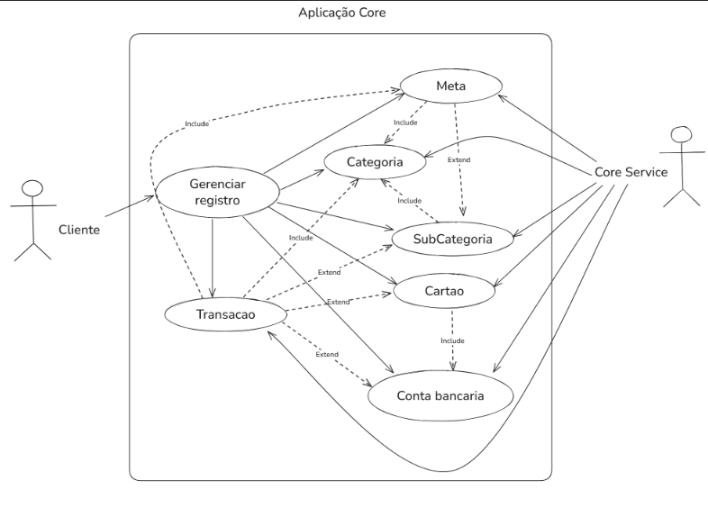
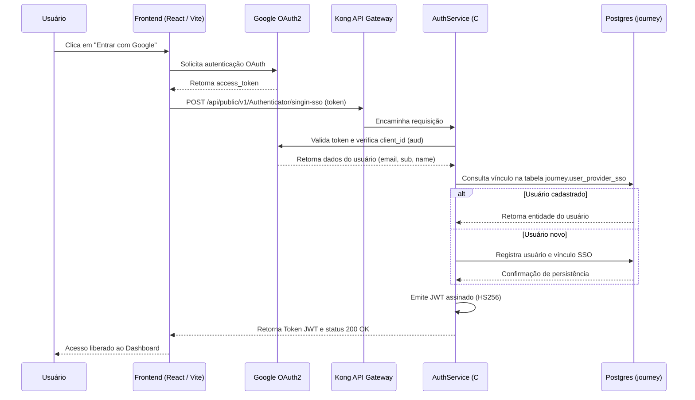
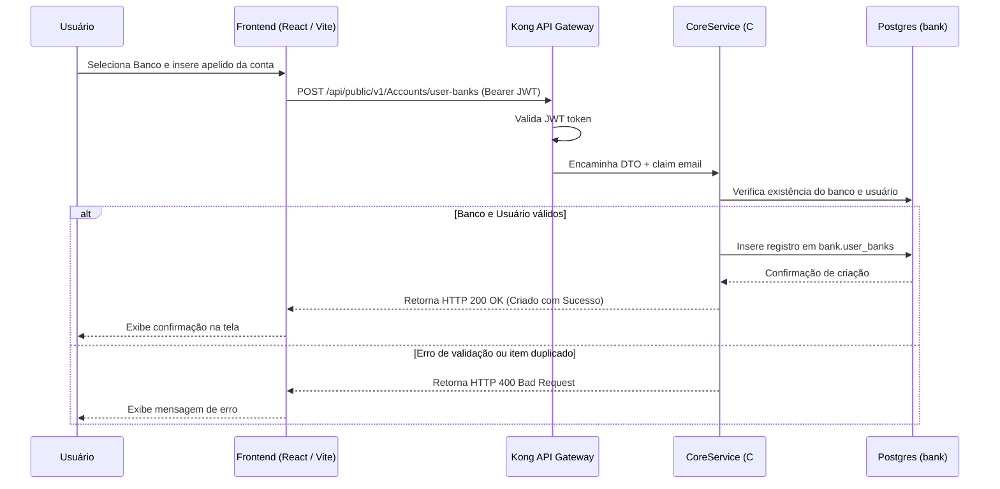
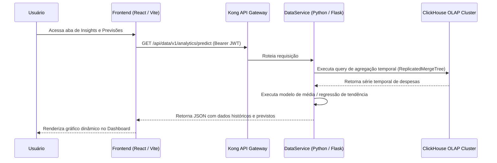
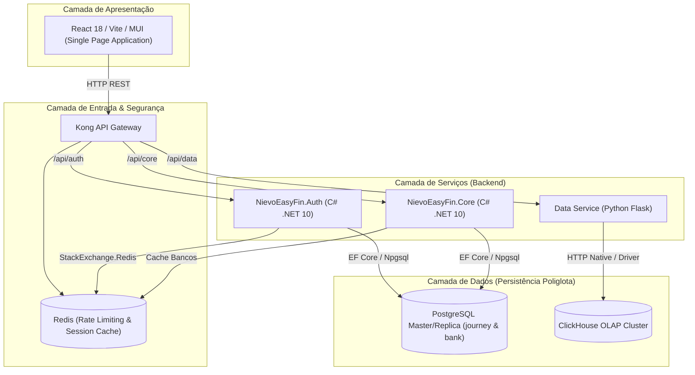
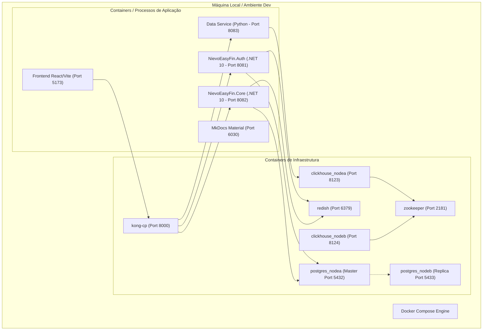
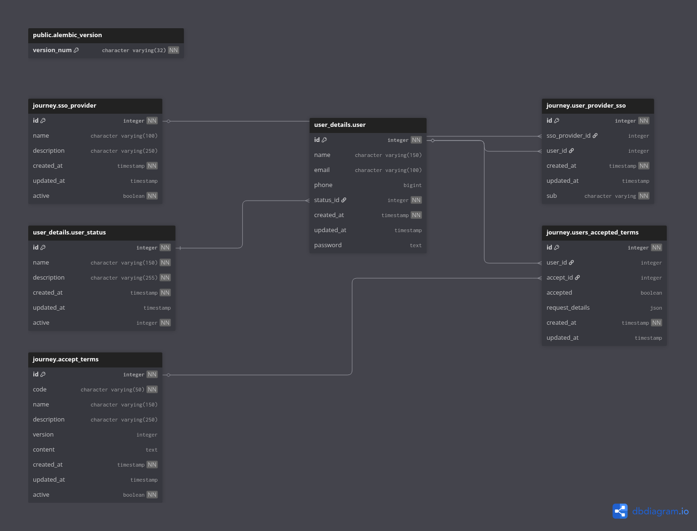

# Sobre o Produto e Casos de Uso

---

## 🎯 Objetivo

Plataforma PaaS para controle financeiro pessoal e de pequenos empreendedores, criada para substituir planilhas manuais propensas a erros de cálculo e de manutenção anual.

---

## 👥 Público-Alvo

Famílias e pequenos empreendedores com necessidade de centralizar a gestão de caixa, prever custos mensais, categorizar despesas e monitorar o atingimento de metas financeiras.

---

## 💡 Funcionalidades do Produto

### 1. Funcionalidades Principais (Core e Auth)
- **Autenticação:** Cadastro tradicional por e-mail/senha e login social via SSO Google.
- **Validação e Segurança:** Confirmação de e-mail por PIN temporário e redefinição de senha com envio por SMTP.
- **Auditoria de Termos:** Obrigatoriedade de aceite dos Termos de Uso com registro de IP/Host e User-Agent.
- **Contas Bancárias:** Vínculo de contas do usuário a instituições financeiras cadastradas (`UserBank`).
- **Cartões de Crédito/Débito:** Gestão de cartões por banco, tipo de cartão e bandeira (`UserBankCard`).
- **Gestão Financeira:** Registro de receitas e despesas com categorização e tags.
- **Metas e Orçamentos:** Definição de limites orçamentários por categoria com acompanhamento em tempo real.
- **Analytics e Dashboards:** Visualização de gráficos dinâmicos de consumo e previsões históricas.

### 2. Funcionalidades Opcionais e Futuras
- Notificações e alertas por e-mail de metas excedidas.
- Integração com Open Finance (PIX e conciliação bancária automática).
- Cotação de moedas e valorização cambial (BRL / USD / EUR).
- Monitoramento de inflação e rendimento de investimentos.

---

## 🖼️ Diagramas do Sistema

### 1. Casos de Uso

#### Serviço de Autenticação (Auth)

#### Serviço Core (Contas e Transações)

#### Serviço de Dados (Analytics)

---

### 2. Diagramas de Sequência

#### Fluxo de Autenticação e SSO

#### Fluxo de Cadastro de Conta Bancária e Cartão

#### Fluxo de Consulta Analítica de Gastos

---

### 3. Diagrama de Componentes

---

### 4. Diagrama de Implantação (Deployment Diagram)

---

### 5. Diagramas de Banco de Dados (SGBD)

#### PostgreSQL - Schema Core e Bank

#### PostgreSQL - Schema Journey e Auth

---

## 🥊 Concorrentes Analisados

- [Kinvo](https://kinvo.com.br/) - Foco em consolidação de investimentos.
- [Minhas Economias](https://minhaseconomias.com.br/) - Controle de orçamento doméstico simples.
- [Meu Dinheiro Web](https://www.meudinheiroweb.com.br/) - Gestão financeira pessoal e de microempresas.
- [Organizze](https://www.organizze.com.br/#recursos) - Interface minimalista para gestão de contas e cartões.
- [Wisecash Web](https://www.wisecashapp.com.br/#/site) - Aplicativo leve para controle de gastos diários.
