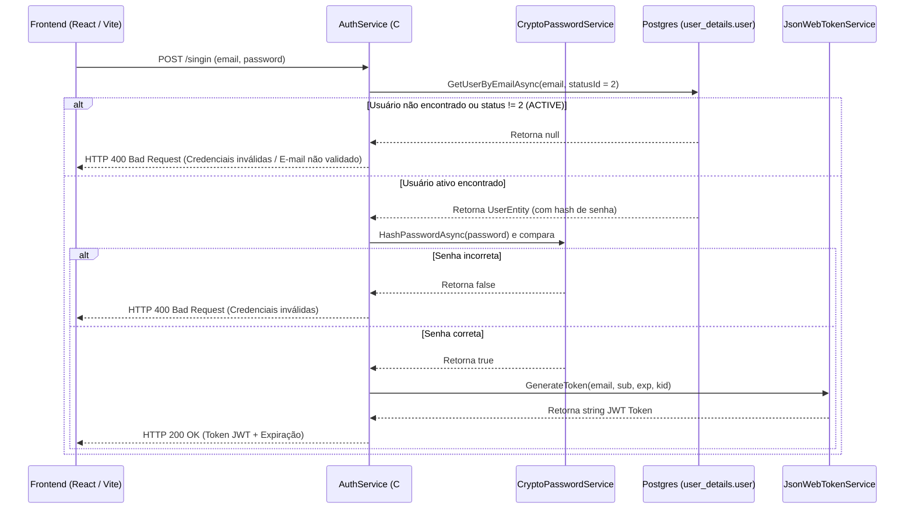
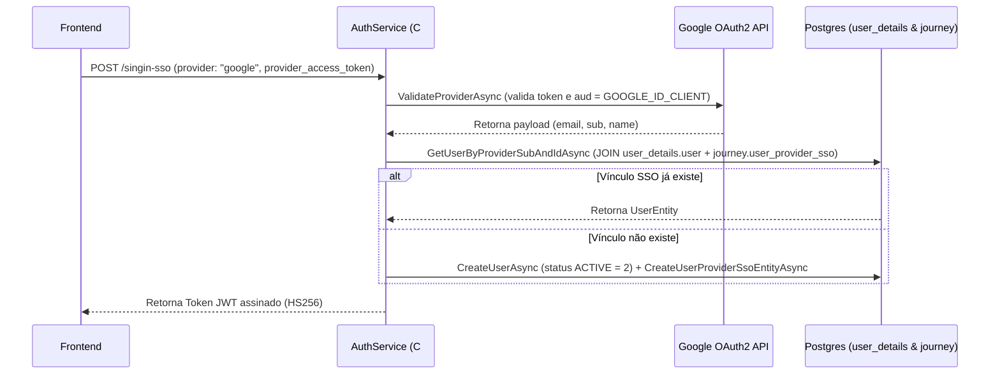

# Fluxo de Autenticação e Segurança

A camada de autenticação e segurança do **Nievo EasyFin** é centralizada no microsserviço `NievoEasyFin.Auth`, gerenciando acessos ao schema `user_details` (dados e status) e `journey` (provedores SSO e termos).

---

## 🔑 1. Autenticação Local (Login Tradicional)

---

## 🌐 2. Autenticação SSO Google

---

## 🔄 3. Redefinição de Senha por PIN

1. **Solicitação (`POST /password-reset`):** O usuário informa o e-mail. Se existir na tabela `user_details.user`, é gerado um PIN de 6 dígitos salvo no Redis (chave `reset_password:{email}`, TTL de 15 min) e enviado via `SmtpProvider`.
2. **Confirmação (`PATCH /password-reset`):** O usuário envia e-mail, PIN e nova senha. O sistema valida o PIN no Redis, gera o novo hash PBKDF2 e atualiza a coluna `password` na tabela `user_details.user` via `UpdateUserPasswordAsync`.
