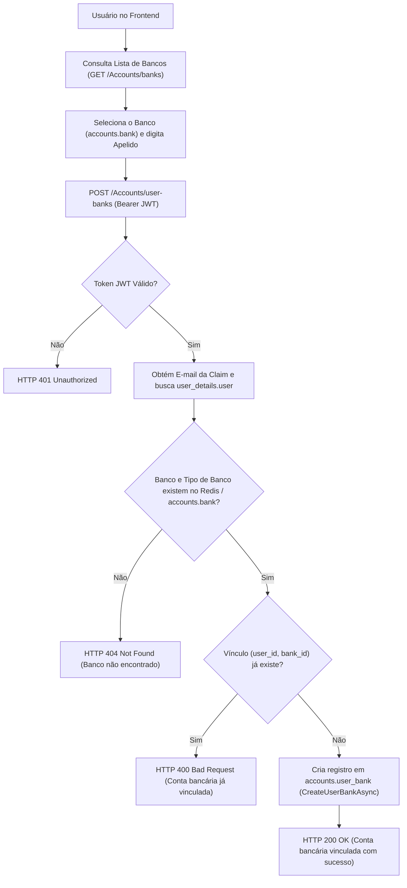
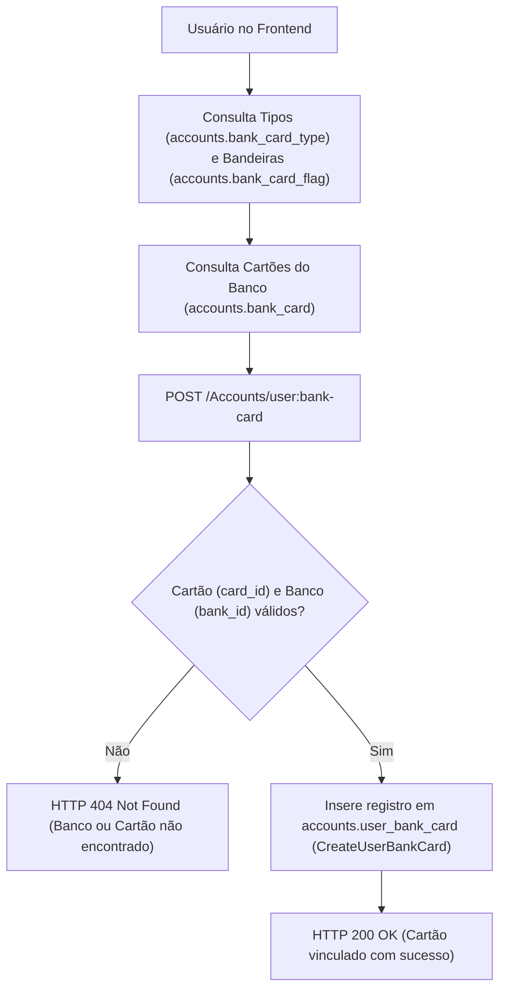

# Fluxo de Gestão de Contas Bancárias e Cartões

A gestão de contas e cartões no **Nievo EasyFin** é coordenada pelo Monólito `NievoEasyFin.Core` atuando sobre o esquema **`accounts`** do PostgreSQL.

---

## 🏦 1. Vínculo de Contas Bancárias (`accounts.user_bank`)

---

## 💳 2. Cadastro e Vínculo de Cartões (`accounts.user_bank_card`)

### 📌 Tabelas do Esquema `accounts` Utilizadas:
- `accounts.bank`: Instituições bancárias cadastradas (`id`, `name`, `bank_type`, `active`).
- `accounts.bank_type`: Classificação de bancos (`id`, `name`, `description`).
- `accounts.user_bank`: Vínculo entre usuário e banco (`id`, `user_id`, `bank_id`, `nick_name`, `active`).
- `accounts.bank_card`: Catálogo de cartões (`id`, `bank_id`, `name`, `card_type`, `flag_id`, `active`).
- `accounts.bank_card_type`: Tipos de cartão (`Crédito`, `Débito`, `Múltiplo`).
- `accounts.bank_card_flag`: Bandeiras (`Visa`, `Mastercard`, `Elo`, `Amex`).
- `accounts.user_bank_card`: Cartões do usuário (`id`, `bank_id`, `card_id`, `user_id`, `name`, `expired_at`, `active`).

---

## 🛡️ 3. Operações Administrativas (`/api/private/v1/Accounts`)

- **`POST /api/private/v1/Accounts/banks`:** Insere registros na tabela `accounts.bank`.
- **`POST /api/private/v1/Accounts/bank-card`:** Insere produtos no catálogo `accounts.bank_card`.
