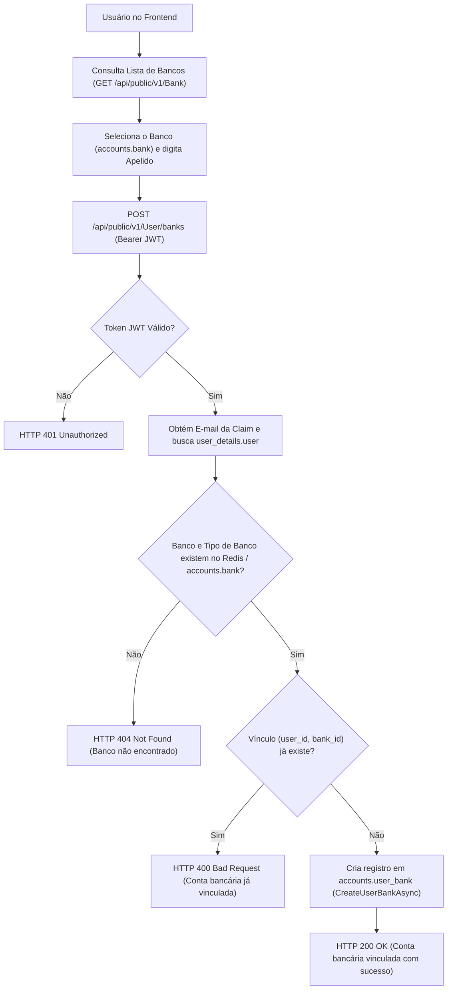
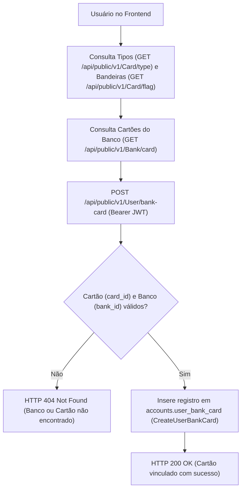

# Fluxo de Gestão de Contas Bancárias e Cartões

A gestão de contas e cartões no **Nievo EasyFin** é coordenada pelo Monólito `NievoEasyFin.Core` atuando sobre o esquema **`accounts`** do PostgreSQL, estruturada em controladores RESTful específicos (`UserController`, `BankController` e `CardController`).

---

## 🏦 1. Vínculo de Contas Bancárias (`accounts.user_bank`)

```mermaid
flowchart TD
    User["Usuário no Frontend"] --> SearchBank["Consulta Lista de Bancos (GET /api/public/v1/Bank)"]
    SearchBank --> SelectBank["Seleciona o Banco (accounts.bank) e digita Apelido"]
    SelectBank --> PostUserBank["POST /api/public/v1/User/banks (Bearer JWT)"]
    
    PostUserBank --> CheckAuth{"Token JWT Válido?"}
    CheckAuth -->|Não| HTTP401["HTTP 401 Unauthorized"]
    CheckAuth -->|Sim| FindUser["Obtém E-mail da Claim e busca user_details.user"]

    FindUser --> FindBank{"Banco e Tipo de Banco existem no Redis / accounts.bank?"}
    FindBank -->|Não| HTTP404["HTTP 404 Not Found (Banco não encontrado)"]

    FindBank -->|Sim| CheckExists{"Vínculo (user_id, bank_id) já existe?"}
    CheckExists -->|Sim| HTTP400["HTTP 400 Bad Request (Conta bancária já vinculada)"]

    CheckExists -->|Não| SaveUserBank["Cria registro em accounts.user_bank (CreateUserBankAsync)"]
    SaveUserBank --> HTTP200["HTTP 200 OK (Conta bancária vinculada com sucesso)"]
```

---

## 💳 2. Cadastro e Vínculo de Cartões (`accounts.user_bank_card`)

```mermaid
flowchart TD
    User["Usuário no Frontend"] --> GetOptions["Consulta Tipos (GET /api/public/v1/Card/type) e Bandeiras (GET /api/public/v1/Card/flag)"]
    GetOptions --> GetBankCards["Consulta Cartões do Banco (GET /api/public/v1/Bank/card)"]
    GetBankCards --> PostUserCard["POST /api/public/v1/User/bank-card (Bearer JWT)"]

    PostUserCard --> ValCard{"Cartão (card_id) e Banco (bank_id) válidos?"}
    ValCard -->|Não| HTTP404["HTTP 404 Not Found (Banco ou Cartão não encontrado)"]

    ValCard -->|Sim| SaveCard["Insere registro em accounts.user_bank_card (CreateUserBankCard)"]
    SaveCard --> HTTP200["HTTP 200 OK (Cartão vinculado com sucesso)"]
```

### 📌 Tabelas do Esquema `accounts` Utilizadas:
- `accounts.bank`: Instituições bancárias cadastradas (`id`, `name`, `bank_type`, `active`).
- `accounts.bank_type`: Classificação de bancos (`id`, `name`, `description`).
- `accounts.user_bank`: Vínculo entre usuário e banco (`id`, `user_id`, `bank_id`, `nick_name`, `active`).
- `accounts.bank_card`: Catálogo de cartões (`id`, `bank_id`, `name`, `card_type`, `flag_id`, `active`).
- `accounts.bank_card_type`: Tipos de cartão (`Crédito`, `Débito`, `Múltiplo`).
- `accounts.bank_card_flag`: Bandeiras (`Visa`, `Mastercard`, `Elo`, `Amex`).
- `accounts.user_bank_card`: Cartões do usuário (`id`, `bank_id`, `card_id`, `user_id`, `name`, `expired_at`, `active`).

---

## 🛡️ 3. Operações Administrativas (`/api/private/v1/Bank`)

- **`POST /api/private/v1/Bank`:** Insere registros de instituições financeiras na tabela `accounts.bank`.
- **`POST /api/private/v1/Bank/card`:** Insere novos produtos no catálogo de cartões `accounts.bank_card`.
