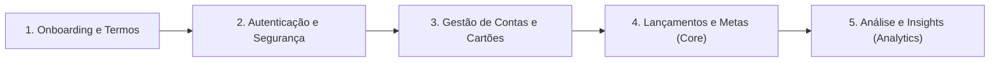

# Fluxos de Negócio

Os fluxos de negócio do **Nievo EasyFin** foram projetados para oferecer uma experiência de gestão financeira pessoal e empresarial simples, segura e transparente, reduzindo o tempo de digitação manual e garantindo a auditabilidade total de dados sensíveis.

---

## 🗺️ Visão Geral das Jornadas do Usuário

---

## 📌 Principais Módulos de Negócio

### 1. [Onboarding e Aceite de Termos](onboarding_termos.md)
Entrada do usuário na plataforma via registro com e-mail/senha ou SSO Google. Obrigatoriedade de aceite dos Termos de Uso (`accept_terms: true`) com armazenamento de evidências legais (Host, User-Agent e Data) na tabela `journey.users_accepted_terms`.

### 2. [Autenticação e Segurança](autenticacao_seguranca.md)
Autenticação via login local ou SSO, validação de e-mail por PIN temporário enviado por e-mail (SMTP / MailKit), redefinição de senha com PIN de segurança de 6 dígitos e emissão de tokens JWT com claims de autorização.

### 3. [Gestão de Contas e Cartões](gestao_contas_cartoes.md)
Modelagem de instituições financeiras (`Bank`), cadastro de contas bancárias do usuário (`UserBank`), e gestão de cartões de crédito/débito (`UserBankCard`), com suporte a múltiplos tipos de cartão e bandeiras (`Visa`, `Mastercard`, `Elo`, `Amex`).

### 4. [Sobre e Casos de Uso](about.md)
Especificação funcional detalhada do produto, público-alvo, comparativo de mercado, diagramas UML (Casos de Uso, Sequência e Implantação) e fontes de pesquisa de mercado.
