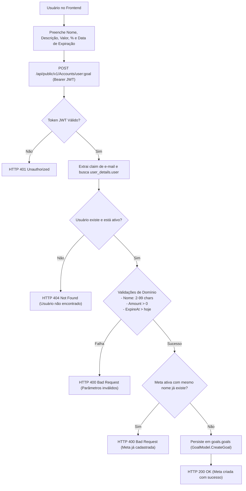
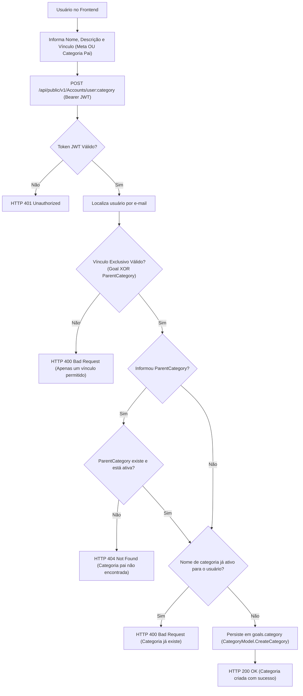
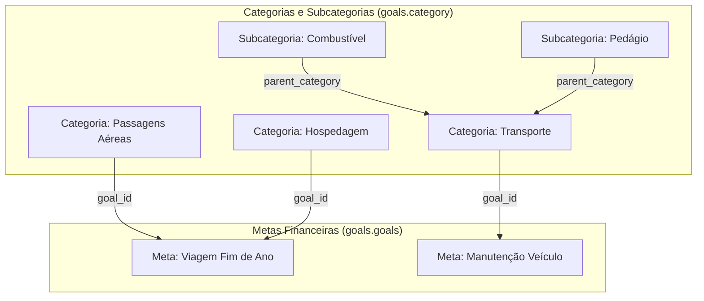

# Fluxo de Planejamento Financeiro: Metas e Categorias

O planejamento financeiro e a classificação de despesas no **Nievo EasyFin** são gerenciados pelo Monólito `NievoEasyFin.Core` operando sobre o esquema **`goals`** do PostgreSQL.

---

## 🎯 1. Gestão de Metas Financeiras (`goals.goals`)

As metas financeiras permitem que o usuário defina objetivos de economia (ex: Reserva de Emergência, Viagem, Compra de Imóvel) ou tetos orçamentários com prazos definidos.

### 📋 Consulta de Metas
- Endpoint: `GET /api/public/v1/Accounts/user:goal`
- Suporta filtros por metas ativas/inativas (`active=true|false`) e paginação (`page`, `page_size`).
- Utiliza consulta Dapper otimizada com a *window function* `count(*) over() as Records` para obter o total de registros e os itens paginados em uma única viagem ao banco de réplica (`CoreReplica`).

---

## 🏷️ 2. Hierarquia e Associação de Categorias (`goals.category`)

As categorias financeiras organizam os lançamentos do usuário e podem ser associadas a uma meta ou estruturadas hierarquicamente (subcategorias).

### ⚖️ Regra de Negócio Crucial: Exclusividade Mútua
Uma categoria **só pode ser criada com exatamente um vínculo**:
1. **Vinculada a uma Meta (`goal > 0` e `parent_category == null`):** A categoria contribui diretamente para o orçamento ou teto da meta especificada.
2. **Vinculada a uma Categoria Pai (`parent_category > 0` e `goal == null`):** A categoria atua como uma subcategoria (ex: `Alimentação` -> `Supermercado`).
3. **Proibido:** Criar categoria sem meta e sem pai, ou fornecendo ambos simultaneamente (`HTTP 400 - POSTUSERCATEGORYASYNC_CORESERVICE_400_CATEGORY_ONLY_CAN_BE_CREATED_WITH_ONE_GOAL_OR_PARENT`).

---

## 🌳 3. Estrutura em Árvore e Consulta Paginada

Ao listar as categorias do usuário via `GET /api/public/v1/Accounts/user:category`, o serviço realiza um `LEFT JOIN` entre `goals.category` e `goals.goals`:

### 🔍 Dados Retornados na Consulta (`UserCategoryView`):
- `id`: Identificador da categoria.
- `name` e `description`: Dados descritivos da categoria.
- `active`: Indicador se a categoria está em uso.
- `parent_category`: Identificador da categoria pai (caso seja subcategoria).
- `goal_name`: Nome da meta financeira associada (obtida via JOIN).
- `goal_description`: Descrição da meta financeira associada.
- `created_at` e `updated_at`: Carimbos de auditoria temporal.

---

## 📌 4. Tabelas do Esquema `goals` Utilizadas

- **`goals.goals`:**
  - `id`: Chave primária SERIAL.
  - `name`: Nome da meta (VARCHAR 150).
  - `description`: Detalhes do objetivo (VARCHAR 255).
  - `amount`: Valor monetário em centavos ou valor percentual.
  - `is_percent`: Flag booleano indicando se o valor representa percentual.
  - `expire_at`: Prazo final de atingimento da meta (DATE).
  - `user_id`: Identificador do usuário proprietário.
  - `active`: Estado ativo/inativo.
- **`goals.category`:**
  - `id`: Chave primária SERIAL.
  - `name`: Nome da categoria (VARCHAR 150).
  - `description`: Descrição (VARCHAR 255).
  - `user_id`: Usuário proprietário.
  - `goal_id`: Chave estrangeira referenciando `goals.goals(id)`.
  - `parent_category`: Chave auto-relacionada apontando para outra categoria.
  - `active`: Estado ativo/inativo.
