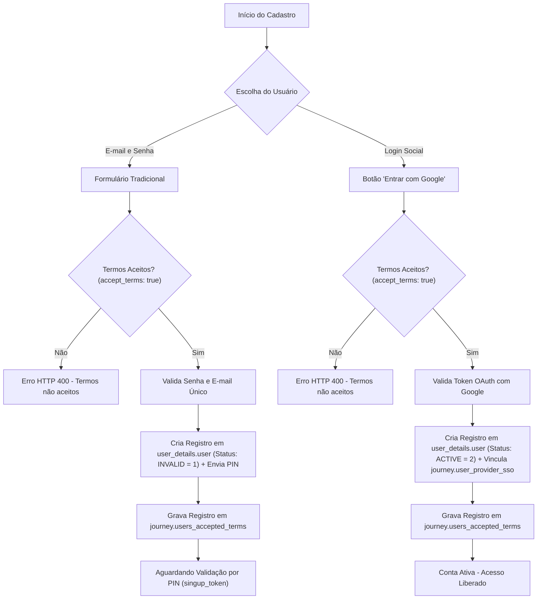

# Fluxo de Onboarding e Aceite de Termos de Uso

O processo de Onboarding no **Nievo EasyFin** garante a criação segura de contas de usuário e a auditabilidade dos Termos de Uso da plataforma.

---

## 📋 1. Modalidades de Cadastro



---

## ⚖️ 2. Auditoria e Persistência do Aceite de Termos

Para fins de conformidade legal, o aceite dos termos é persistido com evidências da requisição do usuário.

### 📌 Estrutura de Persistência no PostgreSQL:
1. **Consulta do Termo Ativo:**
   - O sistema busca a versão vigente na tabela `journey.accept_terms` usando o código `SINGUP_TERMS` (`GetAcceptTermsWithCodeAsync`).
2. **Inserção do Aceite (`journey.users_accepted_terms`):**
   - `user_id`: ID do usuário recém-criado na tabela `user_details.user`.
   - `accept_id`: ID do termo vigente retornado de `journey.accept_terms`.
   - `accepted`: Valor booleano `true`.
   - `request_details`: Objeto JSON com os metadados dos cabeçalhos HTTP extraídos pelo método `MountRequestDetails`:
     ```json
     {
       "Host": "api.nievo.com.br",
       "UserAgent": "Mozilla/5.0 (X11; Linux x86_64)..."
     }
     ```
   - `created_at`: Data e hora da operação.

---

## ✉️ 3. Confirmação de E-mail por PIN

1. **Status Pendente:** O usuário é gravado em `user_details.user` com `status_id = 1` (`INVALID`).
2. **Cache do PIN:** O `AuthDbCacheService` cria o token de 6 dígitos no Redis com a chave `singup_token:{email}` (TTL de 15 min).
3. **Envio de E-mail:** O `SmtpProvider` envia a mensagem em HTML contendo o PIN.
4. **Ativação (`POST /validate:email`):**
   - O usuário envia e-mail e `pin_token`.
   - Havendo correspondência com o cache, o status é alterado para `status_id = 2` (`ACTIVE`) no PostgreSQL via `UpdateUserStatusAsync`.
