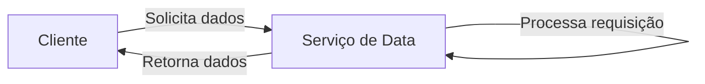

# Diagram

```mermaid
%% Use Case Diagram for Data Service (caso_uso_data)
flowchart LR
    Cliente[Cliente] -->|Solicita dados| DataService[Serviço de Data]
    DataService -->|Retorna dados| Cliente
    DataService -->|Processa requisição| DataService
```

> *Nota*: substitua o placeholder pelos detalhes reais quando disponíveis.
